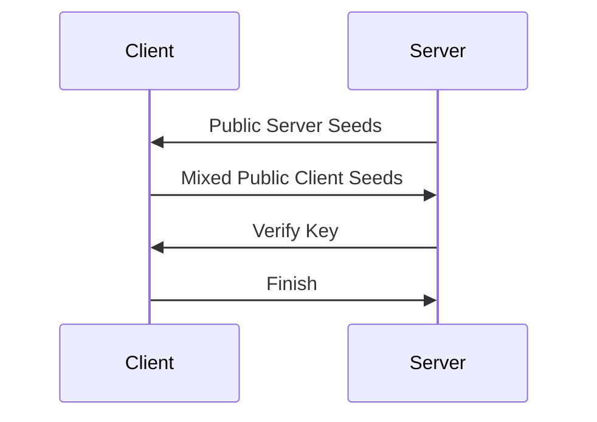

This is a series of posts about Silkroad Online or, more specifically, about things I encounter when writing my [skrillax](https://github.com/kumpelblase2/skrillax) emulator for it. To lay the foundation making the later parts understandable, this introduction provides the basics of the network protocol used in Silkroad Online. None of this is really new information and is simply compiled to provide a self contained explanation.

When designing a (network) protocol, there are a few things you want to strive for. One of the being avoiding ambiguity and another being consistency. You wouldn't want a packet to be parsed differently, depending on the time of day. Or if you want to represent a concept, like a list of something, to be encoded in several different ways. This makes it significantly easier to parse and work with as it allows for a single, simple parsing pass and better reuse of code across different areas. In the following I want to look closer that the protocol used by [Silkroad Online](https://www.joymax.com/SilKRoaD/), but first lets go over some basics.

## Network Protocols

A network protocol is the schema two parties use to communicate with each other and exchange information. Otherwise, each party would receive a bunch of bytes that they wouldn't know how to use. Just like how a file is essentially just random bytes to anyone unless they know the file format. 

## Basic Block: Frames

An important building block for network protocols is a basic message, or: frame. It's essentially the most minimal structure of anything in the protocol. Anything less and there'd be not enough data to be useful and anything more you'd end up with too much situational data. Essentially, once something applies to _all_ messages of a protocol, it's part of the frame. Common things that show up in a frame are the length of the content or the frame itself, and something like a message type. The length is necessary as most underlying protocols (such as TCP) may split one of your frames and spread it over multiple packets or actually send multiple frames inside one packet and the other side needs to know when a frame over in both of these cases. Providing the length, instead of using - e.g. - a delimiter, makes it easier for the receiver to allocate appropriate amounts of memory as it is now possible to know this before reading possibly large amounts of bytes. A kind of message type would define what is to be expected inside the frame, which may have a more complicated structure.

Silkroad does have a pretty decent frame structure:
```text {title="Silkroad Frame"}
 0                   1                   2                   3  
 0 1 2 3 4 5 6 7 8 9 0 1 2 3 4 5 6 7 8 9 0 1 2 3 4 5 6 7 8 9 0 1
+-+-+-+-+-+-+-+-+-+-+-+-+-+-+-+-+-+-+-+-+-+-+-+-+-+-+-+-+-+-+-+-+
|             Length            |             Opcode            |
+-+-+-+-+-+-+-+-+-+-+-+-+-+-+-+-+-+-+-+-+-+-+-+-+-+-+-+-+-+-+-+-+
|    Counter    |      CRC      |                               |
+-+-+-+-+-+-+-+-+-+-+-+-+-+-+-+-+                               +
|                                                               |
+                              Data                             +
|                                                               |
+-+-+-+-+-+-+-+-+-+-+-+-+-+-+-+-+-+-+-+-+-+-+-+-+-+-+-+-+-+-+-+-+
```
<!-- $ protocol "Length:16,Opcode:16,Counter:8,CRC:8,Data:80" -->
As you can see, it contains very little additional data, but it does contain enough to let a receiver separate the stream of bytes it receives into separate messages. The length specifies the length of the data contained in it, but since the header of the frame has a known length, we can easily calculate the total size of a frame. CRC is a checksum of the content to ensure a bit didn't flip on accident and Counter is a to protect against replay attacks. Both of these are only really sent by the client. The data itself is variable length and depends on the opcode. That opcode specifies what is actually contained in this frame, i.e. the operation to be performed by this packet.

So far so good, but this is not the full story. Silkroad does support encryption of packets so that, for example, the login credentials don't get sent as plain bytes. In Silkroad this is done by masking the `Length` info with `0x8000`, such that:
```js
const is_encrypted = (length & 0x8000) != 0;
```
The remainder of the frame, including the rest of the header, is then encrypted. One might assume that `Length` would now identify the encrypted length of the frame, but that would be incorrect. The `Length` is actually still the length of the cleartext content. That means you need to calculate the encrypted size yourself to figure out how many bytes you'll need to read. Depending on the encryption there might be a 1-to-1 relationship in size _or_ a block cipher is used and is thus a multiple of the block size.

Sikroad is using an old, but still secure[^1] cipher: `blowfish`[^2]. Blowfish has a block length of 8 bytes. If the content + header is smaller than a multiple of 8 bytes, it will be padded to match the 8 byte block length - standard stuff. Thus, the calculation for the length would be something like:
```js
// Since the header is also encrypted, we need to account for that by adding 4. 
const content_length = length + 4;
// `(8 - (content_length % 8))` will return the missing bytes to fill the next 8 byte
// block for blowfish.
const padded_length = content_length + (8 - (content_length % 8))
```
Assuming, of course, we actually have an encrypted packet. With `padded_length + 2` we now know the final size of the frame sent. To actually read the content, one would have to know the encryption key. That's for another time - for now we assume we have established a shared secret already.

With this, we can segment every packet stream sent across the wire between the Silkroad client and a server. If you'd rather not write this yourself, you can take a look at my [skrillax-codec](https://crates.io/crates/skrillax-codec) crate, which can handle this for you.

## Encryption

To also be able to decrypt/encrypt packets, we need to first do a handshake. After the handshake both parties (server and client) will end up with the same shared secret. In the case of Silkroad Online, the server will start the handshake as the first thing when a connection has been established. In most cases, the server requires this handshake to be completed before continuing with the connection and is therefor vital to get correct. The handshake uses the normal frames, which we've established now, to convey the operations done in the handshake. The flow for the handshake is as follows:



This is very reminiscient of a [Diffie-Hellman key exchange](https://en.wikipedia.org/wiki/Diffie%E2%80%93Hellman_key_exchange), just a bit homegrown. Maybe they should've done that, because due to their setup, they ended up with only 31 bits of actually private material. This is comparatively easy to break on modern systems, taking less than a minute on most desktop computers. So if the key exchange is observed, it is possible to decrypt all packets sent between the client and server for that connection. I actually wrote a tool that does it automatically for any pcap file, which you can find in my [skrillax repo](https://github.com/kumpelblase2/skrillax/tree/9d8d5384e2178c6f0f2ba80984284583da901e7c/silkroad-packet-decryptor)[^3].

I won't cover more details here of what is exactly exchanged in which packet - you can look at the [documentation](https://github.com/DummkopfOfHachtenduden/SilkroadDoc/wiki/silkroad-security) compiled by DaxterSoul, originally written by pushedx. I'd assume most implementations are at least in part based on that documentation; including [mine](https://github.com/kumpelblase2/skrillax-network/tree/master/crates/skrillax-security).

## Packet data

To actually read and write the necessary packets in the handshake, we need to know how we can read the bytes inside a packet. Unlike a self-describing format, if you don't know the structure of the data contained in a packet, you won't be able to parse the packet into a usable structure. Just like how you wouldn't which bytes make up which pixels in an image file without also knowing the format, like png or jpg. And obviously Joymax is not interested in publishing a spec for the individual packets, so it's up to reverse engineering to figure out what the structure could be - for each individual operation. Though there are obviously patterns that one can look for.

A thing of note here is Silkroad uses [little-endian notation](https://en.wikipedia.org/wiki/Endianness), even though in networking it's usually more common to use [big-endian notation](https://datatracker.ietf.org/doc/html/rfc1700#page-3). But with that in mind, we can find most C data types to be represented as their binary in-memory representation, just with little-endian notation. This includes `bool` (1 byte), `char` (1 byte), short (2 bytes), int (4 bytes), and float (4 bytes). As example, the short `1337`, or `0x0539` in hex, would be represented as `[0x39, 0x05]` in the packet data. But that is about as much as we can expect; without the self-describing nature, we won't see patterns like field separators or type IDs to show up and help us. Yet, one could feasibly expect that Silkroad isn't just shoving bytes into packets with a clear idea of structure. And most certainly they are serializing their C/C++ structs into packets, just the structure is lost in translation. In other words, the following struct:
```c
struct Position {
  short x;
  short y;
};

struct Position pos = {
  .x = 1641,
  .y = 3732
};
```
would end up serialized in the packet data as:
```
0x69 0x06 0x94 0x0E
```

Without the structure, this might as well be 4 single byte values or one `int` value (`244581993`) - it all depends on the expected structure. There are some things that hint at the size, but these are never a guaranteed indicator. For example, the following byte stream:
```
0x01 0x80 0x00 0x00 0x80
```
_could_ hint at an `int` followed by a `char`/`byte`, due to the zero bytes being the higher bits of a small number represented by the `int`. But it might as well be a `bool` followed by an `int`. You literally cannot tell just by looking at the bytes alone without context, which makes reverse engineering not a simple task.

Lets move on for now and look at a more complex "basic" type: a string. While in C, a string is just a series of bytes until a null-byte, it is something that is inherently variable in length. On the reading side, we'd prefer if we could know the length ahead of time. Thus, we're nice and start with the length as a `short`, followed by each character, _excluding_ the null byte. Because of the explicit length, there's no need for a null-byte as a terminator. Thankfully, strings are one of the easier structures to figure out, as most tools display the ascii equivalents next to hex values.

Ignoring the `0x04` byte for now, we can see the length as `[0x08 0x00]` - so 8 - followed by the text, now clearly visible: 'Skrillax'.

There are even more of such structures, of course, but lets explore them another time.

## Closing

With this, you should now be able to read and understand the protocol at a basic level. You can check the structure of known packets on the wiki[[1]](https://github.com/DummkopfOfHachtenduden/SilkroadDoc/wiki/Global-packets)[[2]](https://github.com/DummkopfOfHachtenduden/SilkroadDoc/wiki/Gateway-packets)[[3]](https://github.com/DummkopfOfHachtenduden/SilkroadDoc/wiki/Agent-packets), though they are for an old version of the game (v1.188). You can also take a look at [skrillax-network](https://github.com/kumpelblase2/skrillax-network) which handles all the network related stuff for you, including serialization and deserialization. There's even a [mini client example](https://github.com/kumpelblase2/skrillax-network/tree/master/examples/simple-official-client) that will print out all current notices if you want something you can try out yourself right now.

[^1]: Due to an oversight in the key exchange used in Silkroad it is, however, relatively easy to brute force the secret key.
[^2]: More accurately, it's using a version known as "blowfish compat", which is blowfish with different endianness.
[^3]: I restructured the emulator, causing the decryptor to end up nowhere so this is a deep link into the repo for now. I'm trying to find a good way to put it in a new repo as a standalone thing somewhere.